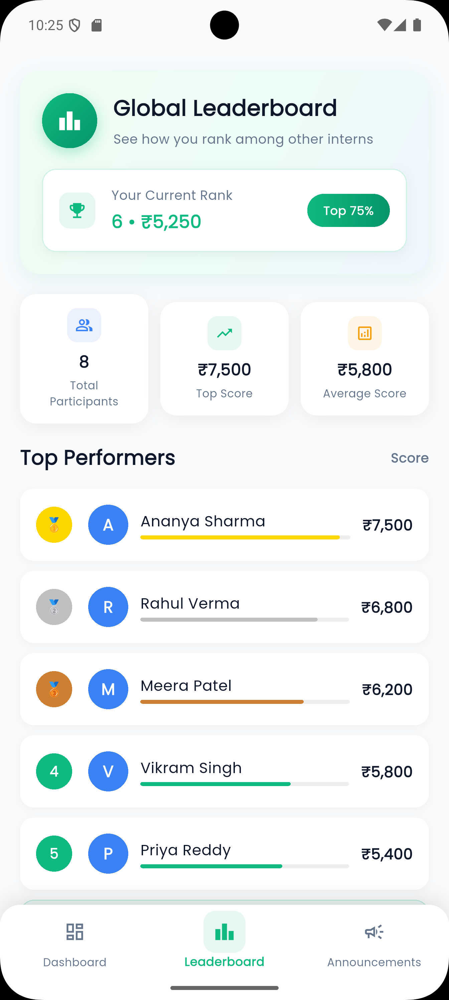
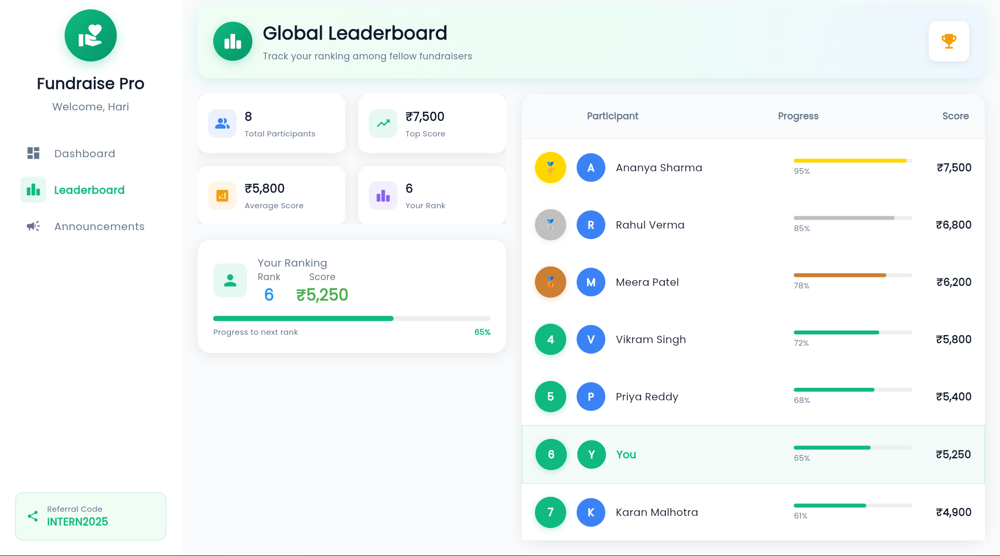
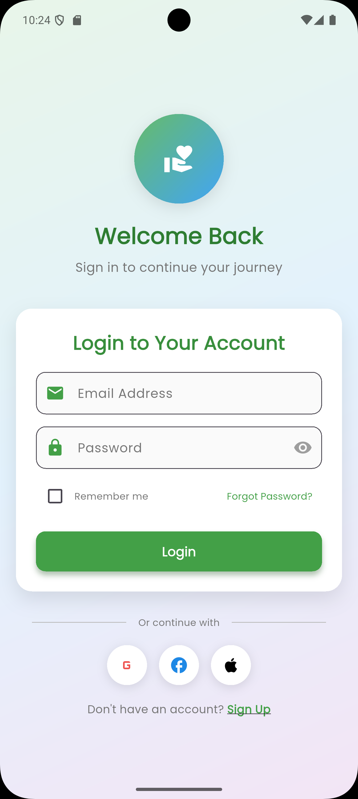
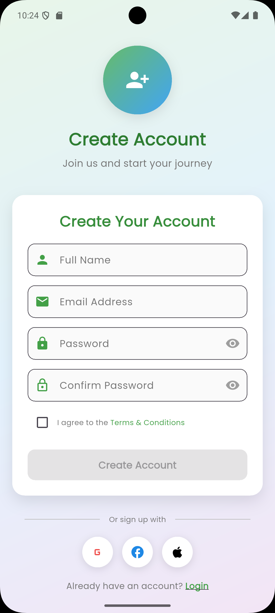
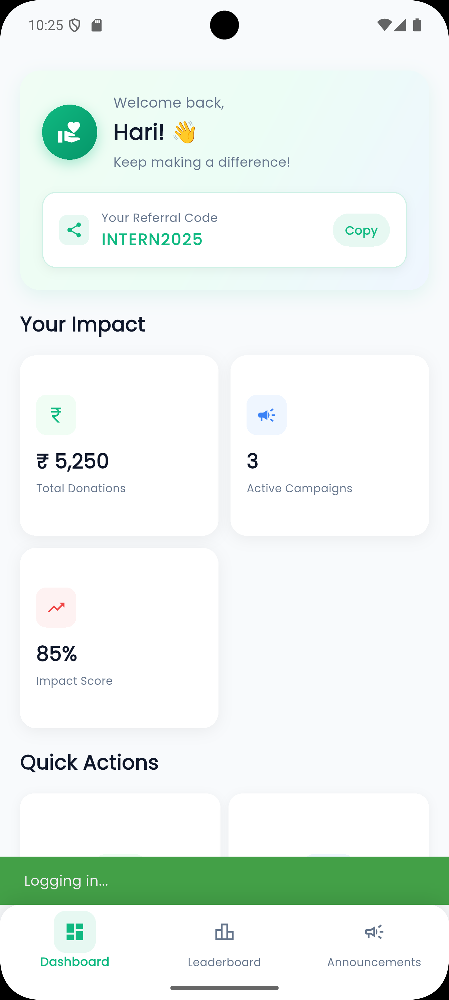
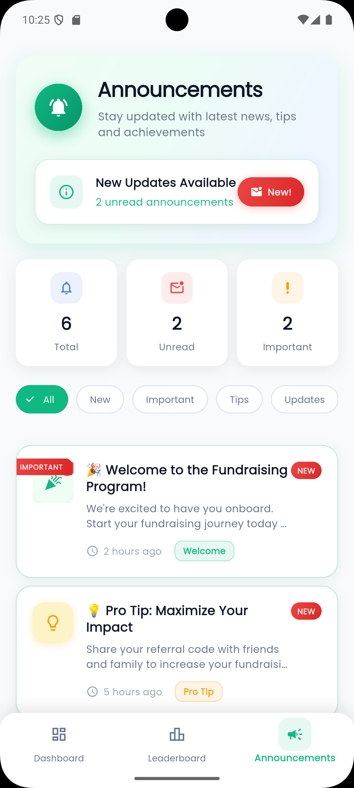
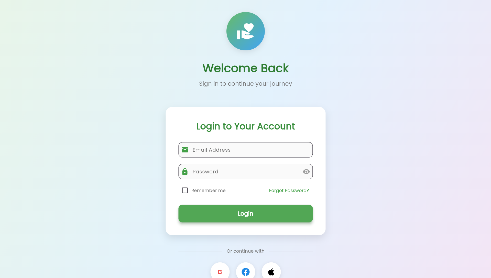
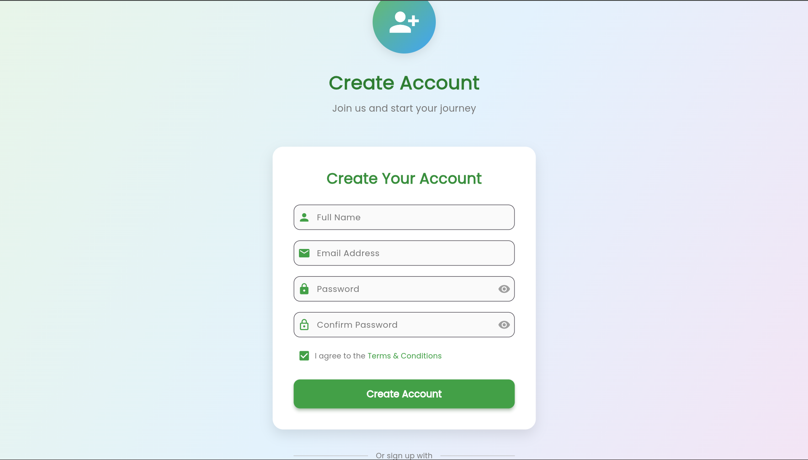
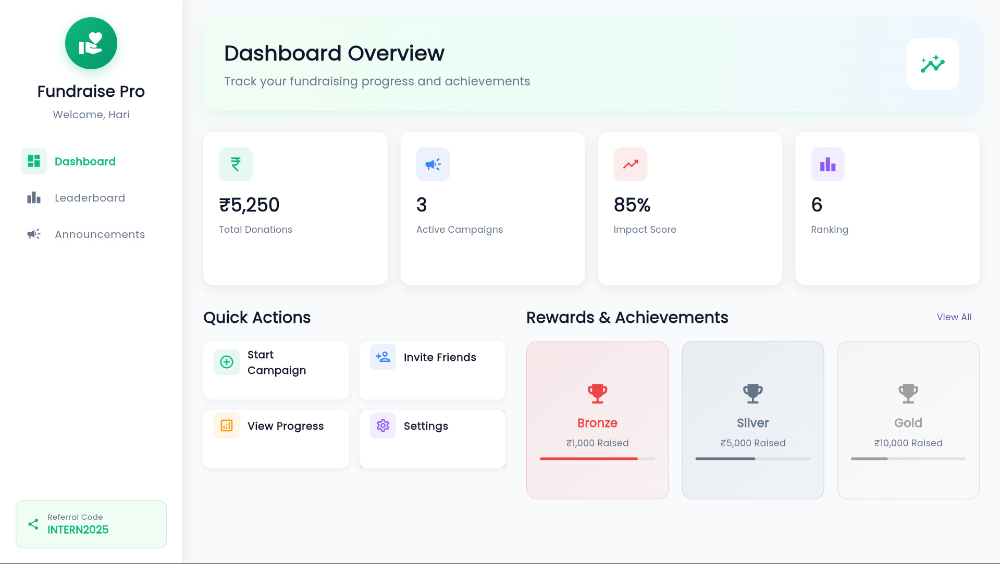
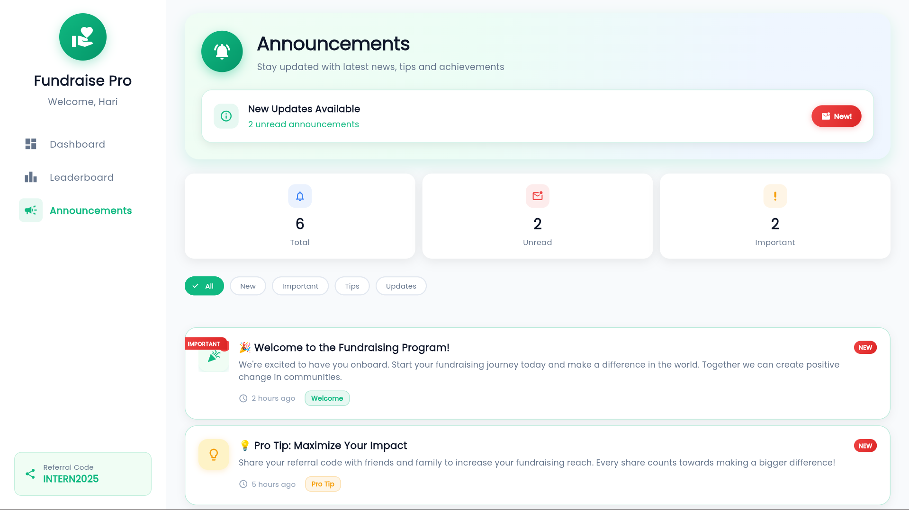

# 📱💻 Flutter Intern Dashboard  

> 📌 This project was developed as part of a task assigned by **She Can Foundation**, aimed at simulating a fundraising intern dashboard with a strong focus on responsive design, clean UI, and cross-platform (mobile & web) support.


  
  
  

<p align="center">
  
  &nbsp;&nbsp;&nbsp;
  
</p>

A simple **responsive Flutter app** simulating a fundraising intern portal.  
Built with clean UI, dummy data, and designed to work on **both mobile and web**.  

---

## 🚀 Features  

- 🔐 **Login & Signup (UI only, no backend)**  
- 📊 **Dashboard** – Intern name, referral code, donations, rewards  
- 🏆 **Leaderboard** – Static list of interns with donation scores  
- 📢 **Announcements** – Static messages and tips  
- 📱💻 **Responsive Design** – Works seamlessly on mobile and web  
- 🎨 **Clean UI** with Google Fonts  

---

## 🖼️ Screenshots  

### 📱 Mobile View  
| Login | Signup | Dashboard | Leaderboard | Announcements | 
|-------|--------|-----------|-------------|---------------|
|  |  |  |  |  |

---

### 💻 Web View  

<p align="center">
  
</p>

<p align="center">
  
</p>

<p align="center">
  
</p>

<p align="center">
  
</p>

<p align="center">
  
</p>

---

## ⚙️ Installation & Setup  

### Prerequisites
- **Flutter SDK** (version 3.0 or higher)
- **Dart** (version 3.0 or higher)
- **IDE**: Android Studio, VS Code, or any preferred editor
- **Chrome browser** (for web testing)

### Step 1: Clone the Repository
```bash
git clone https://github.com/your-username/intern-dashboard.git
cd intern-dashboard
```

### Step 2: Install Dependencies
```bash
flutter pub get
```

### Step 3: Run the Application

#### For Mobile (Android/iOS):
```bash
flutter run
```

#### For Web:
```bash
flutter run -d chrome
```

#### For Specific Device:
```bash
# List available devices
flutter devices

# Run on specific device
flutter run -d <device_id>
```

### Step 4: Build for Production

#### Build APK (Android):
```bash
flutter build apk --release
```

#### Build App Bundle (Android):
```bash
flutter build appbundle --release
```

#### Build for Web:
```bash
flutter build web --release
```

---

## 📁 Project Structure

```
├─ main.dart
├─ screens/
│ ├─ login_screen.dart
│ ├─ signup_screen.dart
│ ├─ dashboard_screen.dart
│ ├─ leaderboard_screen.dart
│ └─ announcements_screen.dart
└─ widgets/
└─ reward_card.dart
```

---

## 🛠️ Development

### Adding New Features
1. Create new screen in `lib/screens/`
2. Add corresponding route in `lib/main.dart`
3. Update navigation in respective screens
4. Test responsiveness on both mobile and web

### Testing Responsiveness
```bash
# Test on multiple devices simultaneously
flutter run -d chrome,android
```

---

## 🤝 Contributing

1. Fork the project
2. Create your feature branch (`git checkout -b feature/AmazingFeature`)
3. Commit your changes (`git commit -m 'Add some AmazingFeature'`)
4. Push to the branch (`git push origin feature/AmazingFeature`)
5. Open a Pull Request

---

## 📝 License

This project is licensed under the MIT License - see the [LICENSE](LICENSE) file for details.

---

## 🆘 Troubleshooting

### Common Issues:

**1. Flutter not found:**
```bash
# Ensure Flutter is in your PATH
export PATH="$PATH:`pwd`/flutter/bin"
```

**2. Chrome not detected:**
- Install Chrome browser
- Or specify another browser: `flutter run -d edge`

**3. Web renderer issues:**
```bash
flutter run -d chrome --web-renderer html
```

**4. Port already in use:**
```bash
# Kill process using port 3000
sudo lsof -t -i tcp:3000 | xargs kill -9
```

---

## 📞 Support

If you encounter any problems or have questions:
- Create an [issue](https://github.com/your-username/intern-dashboard/issues)
- Check [Flutter documentation](https://flutter.dev/docs)

---

<div align="center">

**Built with ❤️ using Flutter**

</div>

